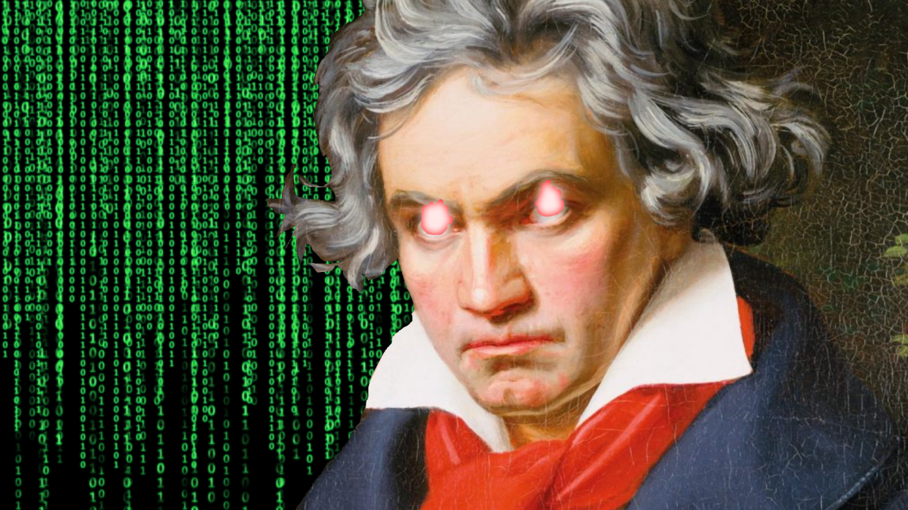

# music-transformer
Deep learning transformer model that generates unique music sequences.

## Abstract
In 2017, a new state-of-the-art was published for natural language processing: the Transformer. Relying solely on attention mechanisms, the Transformer outperformed existing solutions based on recurrent and convolutional neural networks1. However, recurrent neural networks, long short-term memory, and gated recurrent neural networks remain dominant in the field of generative music. I aim to introduce the Transformer into the field of music, with the goal of teaching the deep learning model to predict the second half of a composition given the first half. A Transformer equipped with 32 attention heads and sinusoidal positional encoding was trained on the Nottingham MIDI dataset for 5000 epochs over a period of 48 hours, optimized by stochastic gradient descent and measured with cross entropy loss, and regulated by an exponential learning rate decrease schedule. For the first thousand epochs, the model had noticeable improvement but lacked arrangement to the generated sequences. By five thousand epochs, the model clearly demonstrated the knowledge of general music trends used to better predict how classical composers write their pieces, and most tracks were melodic to the human ear. Future applications of this technique include generating tracks for various instruments, rating the quality of existing music tracks, and complete originality if combined with a generative network mapping melodies to latent space.

1 [Attention Is All You Need](https://arxiv.org/pdf/1706.03762.pdf)

## Video

## Hardware
Ubuntu
- 32 GB RAM
- Intel Core i3-4170 CPU @3.70 GHz x4 (4 GB RAM)
- NVIDIA GeForce GTX 1050 Ti
